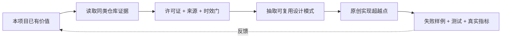

<!-- generated by github-benchmark; edit research JSON, not this file -->
# iching-math｜GitHub 同类项目学习与超越

> 数据截至：2026-07-12T19:35:26.784568Z  
> 当前去向：核心建设  
> 证据状态：已验证资产  
> 原则：借鉴公开架构与验证方法，不复制第三方实现；代码复用必须单独通过许可证审查。

## 1. 当前起点

- **已有价值：** 核心置换、循环型、阶 260、无固定点和 48:15 奇偶步信号可复现。
- **当前阻断：** 公开版本仍有错误基线、标签和因果越界，发现后检验需多重比较边界。
- **原升级方向：** 统一勘误、加入 guardrail，并预注册后续检验。

## 2. 同类仓库证据

| 仓库 | Stars | 许可证与借鉴边界 | 最近推送 | 已核验模式 | 已知不足 |
|---|---:|---|---|---|---|
| [kentang2017/ichingshifa](https://github.com/kentang2017/ichingshifa) | 272 | MIT 架构学习；如复用代码须保留许可证与归属 | 2026-06-22 | src、data、docs、app.py 与 system_prompts 分层；README 逐步解释大衍三变算法与 6/7/8/9 爻值 | 主要目标是占卜与排盘，不研究序列间置换；README 引用传统解释但没有针对数学新颖性的文献检索协议 |
| [zzkt/i-ching](https://github.com/zzkt/i-ching) | 63 | GPL-3.0 只学习公开思想与接口模式；不复制代码 | 2024-11-13 | i-ching.el 为核心实现，tests.el 为测试；支持 yarrow、3-coins、6-bit 三种方法 | 是 Emacs 占卜工具，不处理 King Wen 与自然序的置换循环；远程量子/大气随机源与本地确定性数学验证无关且增加网络依赖 |

## 3. 逐仓证据卡

### [kentang2017/ichingshifa](https://github.com/kentang2017/ichingshifa)

- **匹配理由：** 完整 64 卦数据库、蓍草算法、历法、API 与 Streamlit 展示，为编码数据和交互验证提供邻近基准。
- **固定版本：** `ac1a3f8d89708acc8d547868fc9634c8e2c61d67`
- **共同证据：** [E1](https://github.com/kentang2017/ichingshifa/blob/ac1a3f8d89708acc8d547868fc9634c8e2c61d67/README.md) · [E2](https://github.com/kentang2017/ichingshifa/tree/ac1a3f8d89708acc8d547868fc9634c8e2c61d67/src) · [E3](https://github.com/kentang2017/ichingshifa/blob/ac1a3f8d89708acc8d547868fc9634c8e2c61d67/LICENSE)
- **借鉴边界：** 架构学习；如复用代码须保留许可证与归属
### [zzkt/i-ching](https://github.com/zzkt/i-ching)

- **匹配理由：** 直接使用 6-bit 数、二进制对、爻变和概率分布实现卦生成，和本地二进制自然序/编码研究技术上相近。
- **固定版本：** `e4339cb64a97e0d04a4cb8e7183aeec4e4ae6a29`
- **共同证据：** [E1](https://github.com/zzkt/i-ching/blob/e4339cb64a97e0d04a4cb8e7183aeec4e4ae6a29/README.org) · [E2](https://github.com/zzkt/i-ching/blob/e4339cb64a97e0d04a4cb8e7183aeec4e4ae6a29/tests.el) · [E3](https://github.com/zzkt/i-ching/blob/e4339cb64a97e0d04a4cb8e7183aeec4e4ae6a29/LICENSE)
- **借鉴边界：** 只学习公开思想与接口模式；不复制代码

## 4. 学习—超越结构

## 5. 本项目超越清单

1. 数据文件双人核对并附来源版本、编码约定和哈希
2. 把置换事实、统计观察和语义猜想在 UI/论文中视觉隔离
3. 核心定理只用确定性数组和多语言独立实现复核
4. Monte Carlo 仅回答预注册统计问题，并报告随机种子、样本量、效应和多重检验

## 6. 强制门禁

- 不以 Stars 代替质量、安全、许可证或业务适配判断。
- 无许可证、强 copyleft 或许可证不清晰的仓库只学习思想，不复制代码。
- 每个借鉴点必须指向 README、文档、目录或发布证据，并记录读取日期。
- “超越”必须落到可失败的验收指标，不用功能数量或营销措辞证明。
- 进入生产前仍须通过本项目 PRD、LOOP、UPGRADE 的既有门禁。
